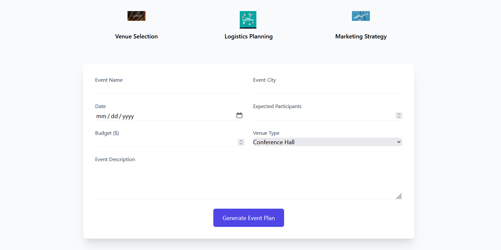

# Enter Event name ,Event city, Event date, budget and venue type and get the best venue for your event.
## This is a simple web app that uses Flask and Google gemini,serper api API and agent to find the best venue and logistic for the event for an event based on the user's input.

## First generate the API key for the serper api and google gemini api and replace the api key in the app.py file.

## To run the app, you need to have Python installed on your computer and install the required dependencies by running `pip install -r requirements.txt`.

## Once the dependencies are installed, you can run the app by running `python app.py` in the terminal.

## The app will start a local server and you can access it by going to `http://localhost:5000` in your web browser.

## You wil see this kink of this UI

# Use of Event planner 

## Venue plan

## Logistics plan

## Marketing plan

